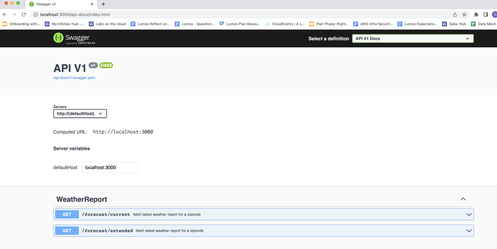

### Objective

* The API provides weather information given a zipcode
* It caches the response for 30 minutes and invalidates if there is a recent weather info for that zipcode

### Assumptions

* The API is exposed publicly, no authentication has been implemented
* The current weather of a location is stored in a database instead of being fetched from remote services
* The weather event information are assumed to be in only 1 unit, degree Celsius or for windspeed in km/hour
* Definition of Current Weather : The last Weather event for that zipcode within last 4 hours. Anything beyond that is stale and not shown as current weather
* Weather Report for that day: High temperature and low temperature will be published for a day range only. A day will be considered based on UTC time
* Extended forecast means 14 days from and including today.
* Expecting zip code as a 5 digit numeric code

### Tech Assumptions
* "LocationWeather" is a collection of events at a given point in time what the current weather conditions are.
* There can be many weather forecast entries for a particular zipcode, as an approach we are not bringing it on memory and then computing high/low, rather relying on SQL Queries to compute them
* For caching we are using memory store. It will wipe out on restart and also limited cache entries will be stored on memory and LRU
* We have relied on Rails low level caching as it will give us more control on cache operations
* For extended forecast, caching has been kept simple to store the same data as requested from the service layer
* We did not found much advantage of storing address as separate table as of now, we are assuming address will be stored as redundant dataset in location_weather
* The scenario of "blank results found" has also been cached, assuming caching is to prevent less load on downstream system 

### Linting
We are using Rubocop for lint check.

`bundle exec rubocop`

### SAST Scanner
We are using Brakeman for SAST scanning.

`brakeman`

### Dependency check for vulnerability

`bundle-audit check --update`

### Using in dev environment

1. Make sure you have ruby > 3.0 and rails > 7.0.1
2. ReCreate schema : `rake db:drop db:create db:migrate`
3. Run db seed script : `rails db:seed`
4. Enable caching if it is disabled using : `rails dev:cache`
5. Hit http://127.0.0.1:3000/forecast/current?zipcode=13271
6. Check for database setup done in seeds.rb for using the zipcodes that have data

### Unit & Integration test

1. Run `bundle exec rspec`

### Swagger API Generation

1. Run `rake rswag:specs:swaggerize`
2. Run `rails s` and go to `http://127.0.0.1:3000` for reaching to swagger documentation and playing around with API's
3. Verify with 13271, 14141 zipcodes
4. 

### Design
* Service Layer is responsible for:
  * creating dto's 
  * caching dto's
  * behaviour. e.g. extended forecast is for 14 days
* Models : Represents persistence mapping with all sql queries and invalidating cache using observers. Also has behaviour focussing on individual entity/model 
* Controller : Fixing/Validating request params, modifying output format and error messages

